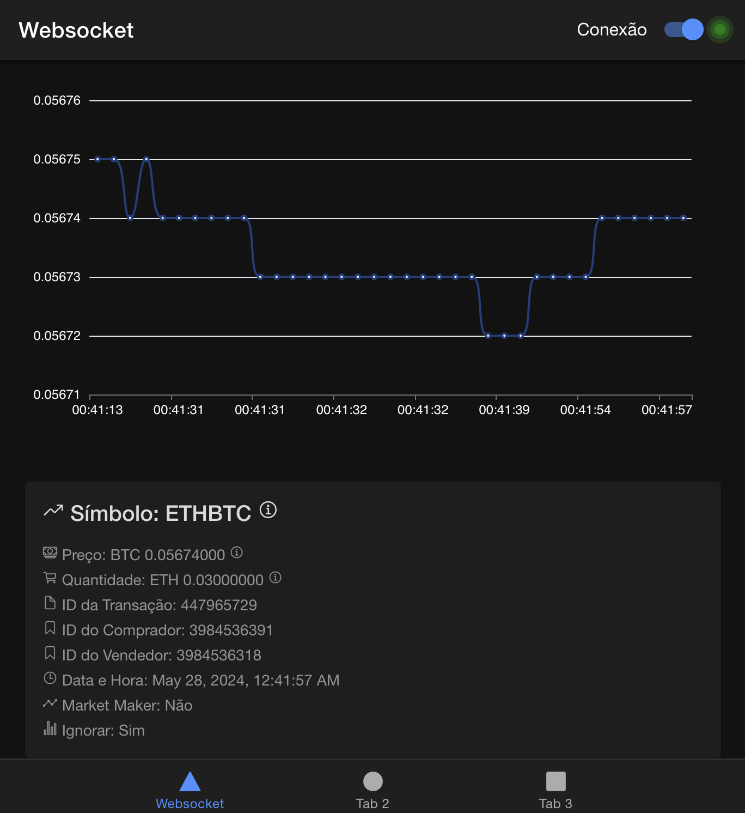

# WebSocket Challenge

## Projeto realizado para teste de conhecimentos de Angular

Foram dadas três opções de projeto, e me coube decidir qual desenvolver. Considerando o prazo e os recursos disponíveis, optei pela conexão WebSocket.

## Objetivo

Desenvolver e apresentar um aplicativo em IONIC com páginas SPA (Single Page Application) com Angular. Esta aplicação deve trabalhar com WebSockets e trazer variação de dados em tempo real, como um aplicativo de investimentos que traz cotações em tempo real de contratos das bolsas de valores.

Tinha a opção de criar uma API para funcionar como uma espécie de BFF, onde meu servidor se conectaria a uma API pública e, em seguida, forneceria os dados. Essa abordagem permitiria tratar a indisponibilidade da API WSS pública, entre outros pontos positivos. Porém, requeria mais tempo.

Com isso, identifiquei uma API próxima do sugerido no desafio. Optei pela Binance por ser simples e prática. Essa API fornece trades entre pares de criptomoedas.

Para exibir os dados dinâmicos em tempo real, optei por plotar um gráfico para deixar os dados mais legíveis e impactantes. Também explorei alguns componentes do IONIC no projeto, como PopOver, Spinner, Toggle, dentre outros.

Durante a configuração do projeto, optei por remover o Jasmine e adicionar o Jest para os testes de unidade. Devido a não fazer uso de uma instância do Chromium, os testes ficaram mais leves e performáticos.

## Algumas das principais tecnologias utilizadas

- Ionic
- Angular 17
- Jest
- Echarts

## Passos/Tarefas realizadas

- Definição da tela
- Setup do projeto
- Configuração de componentes
- Implementação de layout
- Criação de service de acesso à API
- Conexão e consumo dos componentes
- Testes unitários

## Melhorias técnicas

- Aumento da cobertura de testes
- Melhor separação de componentes
- Separação de responsabilidades

## Melhorias de negócio

- Opção de exibir outros trades selecionados pelo usuário
- Tratamento de erros

## Captura de Tela



Espero que esteja de acordo!

## Instalação

Clone o repositório:

```bash
git clone [https://github.com/antonioqm/websocket]
cd websocket
